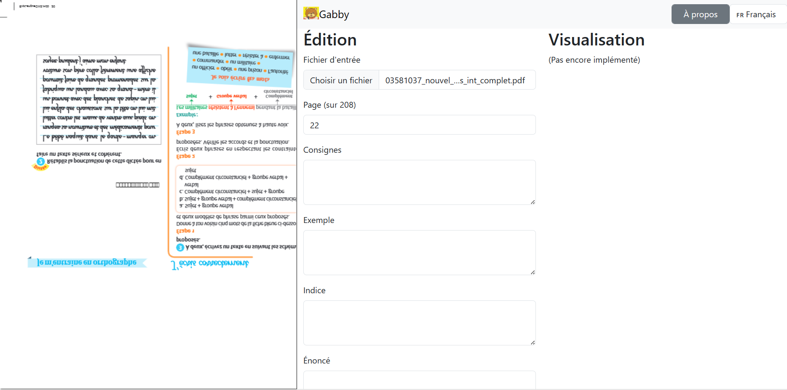

The project stakeholders are French and roadmap items are (hopefully) short-lived so it's not worth translating them.
But as French as I am, my brain has been rewired to think in English when I make software.
So this document is partly in French and partly in English, thank you for your understanding.

> Text like this is a direct quote from a stakeholder.

Other text is mine.

# Known bugs

## PDF upside down

    Gabby version: 20240118-095444
    Locale: fr
    User agent: Mozilla/5.0 (Windows NT 10.0; Win64; x64) AppleWebKit/537.36 (KHTML, like Gecko) Chrome/120.0.0.0 Safari/537.36 Edg/120.0.0.0
    Window size: 1528x742

> Des fois quand on navigue entre les pages, tout d'un coup l'une se met à l'envers.

Input file: 03581037_nouvel_explorons_int_complet.pdf
Screenshot: 

# Functional roadmap

## Next version

### Write user documentation

Choisir si elle fait partie du site ou si elle est un document à part.
Essayer d'y inclure des videos de démonstration, à condition de pouvoir les garder à jour automatiquement quand l'application évolue.

> Je dois te dire qu'Isabelle comme moi avons regardé sans comprendre du tout comment ça marchait. On s'est donc dit que c'était juste une image de ce que serait la future plateforme sans possibilité d'actions. Heureusement qu'il y a Léa, qui a cliqué sur le pdf à divers endroits avant de voir que ça faisait quelque chose.

### Improve navigation in PDF

> Pour le changement de page, ce serait plus intuitif que ça se fasse au niveau du pdf. Peut-être garder les deux façons de passer à la page mais dans la mesure où on travaille sur le pdf au départ, je pense que c'est mieux de passer par le pdf. Accessoirement, les flèches sont contreintuitives pour Léa et Isabelle parce que pour elles, il faut appuyer sur la flèche du haut pour descendre dans les pages donc elles ont le sentiment que c'est à l'envers alors que pour moi qui me rattache au numéro de page, ça parait logique d'appuyer sur la flèche du haut pour augmenter le numéro de page. Dans Adobe, tu cliques sur la flèche du bas pour passer à la page suivante.

> Il faudrait aussi, comme pour un fichier pdf classique pouvoir aller directement à une page (par exemple, page 274) parce que lorsqu'on adapte, on ne fait pas forcément dans l'ordre et surtout on ne fait pas tout d'un coup. Par exemple, on adapte 10 pages le lundi et le mardi on veut aller directement à la page 11. Ou alors, l'enseignant nous donne une liste d'exercices et on doit adapter l'exercice 2 page 12 et le 4 page 130. On arrive à entrer le numéro dans le champ page des fois mais parfois on n'arrive pas à retirer le 1 dans le champ. Si on tape 78, on arrive bien à la page 78 mais le problème est que spontanément on tape sur la touche retour et dans ce cas-là on retombe sur la page démo.

### Automate removing exercice number from instructions

> Lorsqu'on sélectionne la consigne cela met aussi le numéro d'exercice dans la consigne, ce qu'on ne souhaite pas. Il faudrait le retirer et le mettre dans le champ numéro d'exercice à venir

### Adapt field sizes

> Concernant les champs de la partie édition : réduire le champ exemple, réduire le champ indice, agrandir le champ énoncé. On a vu qu'on peut le faire à la main mais peut-on le proposer par défaut ? Idéalement, est-ce que ce serait envisageable de ne pas faire apparaitre les champs exemple et indice quand il n'y en a pas dans l'exercice, ce qui est fréquent ?

### Visualize changes done through the floating modal

> Lorsqu'on ajoute du texte à un bloc, indiquer où le texte a été rajouté (par une surbrillance du bloc par exemple), cela permet à l'utilisateur d'avoir un feedback visuel sur son action, notamment pour vérifier s'il s'est trompé en cliquant. Dans la même gamme d'idée, pour permettre la vérification instantanée par l'utilisateur que tout le texte a bien été ajouté, peut-on adapter la taille de la fenêtre à la totalité du texte pour éviter de devoir scroller dans la fenêtre correspondante de la partie Edition ?

### Keep formatting

> Est-ce qu'il y a un moyen de garder les caractéristiques typographiques genre souligné ou gras facilement ? Parce que parfois, il faut remplacer le mot en gras par exemple.

## Version after the next

### Manage PDFs and their mapping to schoolbooks

> Il manque le nom du manuel en haut. Dans l'idéal, il faudrait qu'on rentre les métadonnées du manuel quelque part avec le nom, l'éditeur, l'année, l'ISBN pour le référencement du manuel à terme

> Il faudrait faire correspondre le numéro de page du manuel (qui n'est pas forcément le rang de la page du pdf) avec la page indiquée dans la fenêtre édition. Ma technique perso consiste à supprimer les pages du pdf qui sont avant la page 1 mais on doit pouvoir implémenter ça, soit de façon automatique, soit de façon manuelle en indiquant au début que les pages commencent à la page 4 du pdf.

### Allow textual exercice identifiers

> Il manque un champ numéro d'exercice, indispensable pour nous. Il faudrait réduire le champ page en longueur et mettre à côté un champ numéro d'exercice. Attention certains exercices sont indiqués non pas par un numéro mais par un nom (par exemple Défi Langue). Il faut donc pouvoir mettre Defi Langue dans le champ du numéro de l'exercice.

## Later

### Ensure usability

Gabby must be usable with screen readers and similar technologies.

> Pour l'ergonomie, Jérôme demande si tu veux interagir avec lui maintenant ou si on attend que tu aies implémenté plus de fonctionnalités avant de se pencher sur l'ergonomie ?

### Automate

> Du côté de l'automatisation : Olivier me dit qu'Elise et lui ont beaucoup travaillé récemment sur l'extraction à partir de la visualisation et donc qu'il y aurait la possibilité de rentrer à gauche des fichiers avec des cadres déjà faits qu'il n'y aurait donc plus qu'à valider ou à retracer si ce ne sont pas les bons. Est-ce envisageable ? Et que faudrait-il faire pour que ce soit implémentable à terme ?

### Allow images in exercices

> On a besoin de pouvoir inclure les images des exercices

### Customize the floating modal

> En termes d'ergonomie de la fenêtre qui s'ouvre quand on sélectionne, il faudrait qu'on puisse l'agrandir et la déplacer. Pour la police, il faudrait mettre de l'arial par défaut. Idéalement, il faudrait que ce soit paramétrable pour chaque adaptateur (taille de la fenêtre, emplacement, police, taille de la police, interligne).

### Handle multiple choice questions

> Il se pose la question des choix qui sont un champ spécifique dans l'adaptation pour les exercices à choix multiples type Cartable. Les choix peuvent être dans la consigne, sous la consigne, dans l'énoncé et ils sont un élément spécifique de l'adaptation. Il faut qu'on voit qu'elle est la meilleure option. Je te mets en PJ les différents types d'exercices à Choix Multiples. Est-ce que tu veux qu'on échange en visio sur ce point ?

### Handle columns

(Maybe never, if integrating Olivier and Elise's automation is enough.)

> Quand le texte est en 2 colonnes, on est obligé de sélectionner la première colonne puis la seconde si on veut que ça se mette dans l'ordre. Je ne sais pas si c'est arrangeable.

# Technical roadmap

See `git grep '@todo'`.
