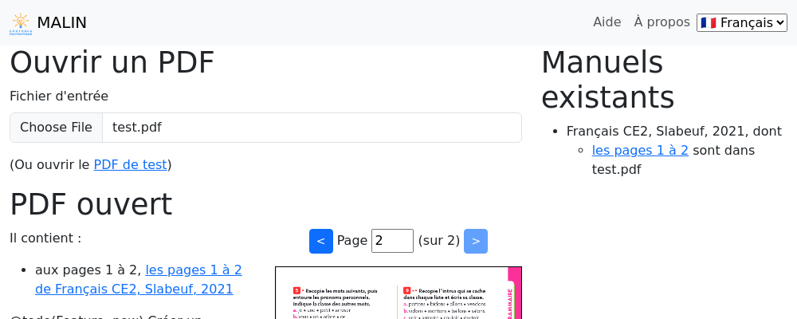
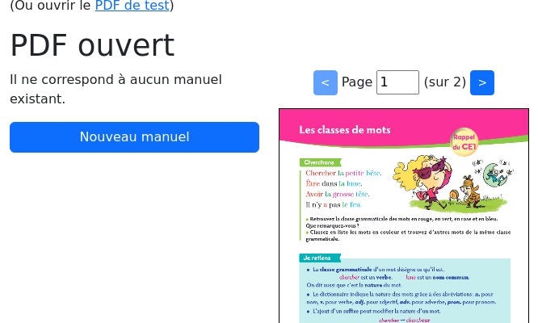
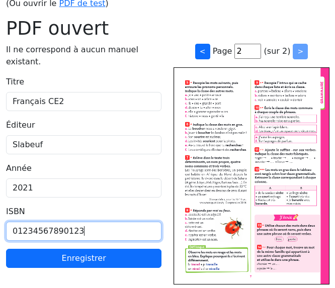

Vue d'accueil
=============

La vue d'accueil de l'application est composée de deux parties :

- sur la gauche pour ouvrir un PDF local et l'associer à un manuel
- sur la droite les liste des manuels existants

Ouverture d'un PDF et création d'un manuel
------------------------------------------

Après avoir ouvrir un PDF, vous pouvez en parcourir les pages.

S'il n'est pas encore connu, vous pouvez créer un manuel associé à ce PDF,
en utilisant le bouton "Nouveau manuel" puis en remplissant le formulaire et en validant avec le bouton "Enregistrer".

Après ça, le manuel apparaît comme associé à ce PDF, ainsi que dans la liste des manuels existants.
Ces liens vous emmèneront jusqu'à la :doc:`vue d'extraction <user-textbook-page>`.
