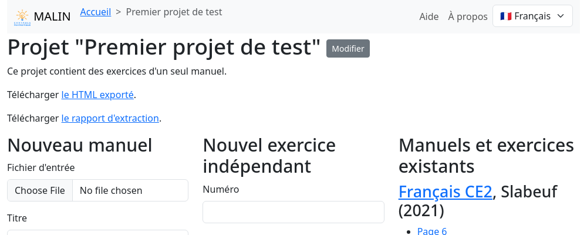
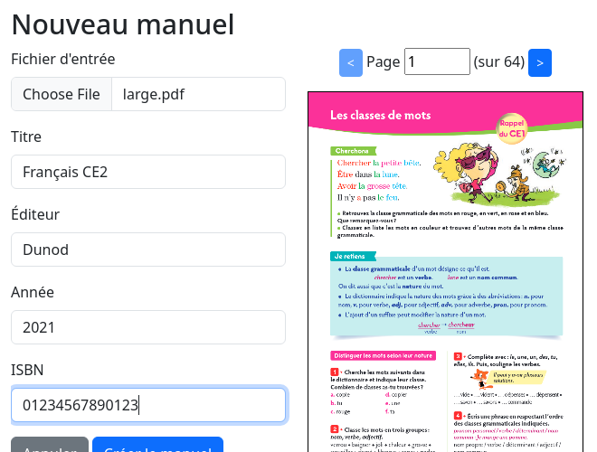

Vue projet
==========

La vue projet est constituée de plusieurs zones:

- un en-tête rappelant le titre et la description du projet
- une colonne permettant d'associer un nouveau manuel au projet
- une colonne permettant de créer un exercice indépendant dans le projet
- une colonne listant les manuels et exercices existant dans le projet

Modification du titre et de la description
------------------------------------------

Le bouton "Modifier" à coté du titre affiche un formulaire permettant de modifier le titre et la description du projet.

Ajout d'un manuel
-----------------

Note: un projet peut contenir des exercices de plusieurs manuels, ainsi que des exercices indépendants sans restriction.
Le formulaire d'ajout de manuel reste donc accessible même si le projet contient déjà un manuel.

Après avoir ouvert un PDF, vous pouvez en parcourir les pages.
Tous les champs du formulaire sont optionnels sauf le PDF et le titre.

Une fois le manuel créé, la :doc:`vue d'extraction <user-project-textbook-page>` est affichée.

Extraction depuis un manuel existant
------------------------------------

Les liens dans la colonne de droite mènent également à la vue d'extraction.

Ajout d'un exercice indépendant
-------------------------------

Cette fonctionnalité n'est pas finalisée.

Téléchargement du rapport d'extraction
--------------------------------------

Un lien permet de télécharger ce rapport destinées aux équipes "machine learning" du projet MALIN.
