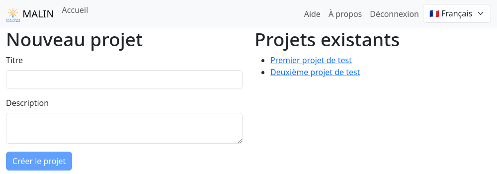

Vue d'accueil
=============

La vue d'accueil de l'application est composée de deux parties :

- sur la gauche un formulaire pour créer un nouveau projet
- sur la droite la liste des projets existants

Un "projet" est un lot d'exercices destinés à être fournis ensemble aux élèves.

Création d'un projet
--------------------

Un projet doit avoir un titre ; il est affiché dans la colonne de droite.

Il peut avoir une description fournissant davantage d'informations.

Une fois le projet créé, la :doc:`vue projet <project>` est affichée.

Projets existants
-----------------

Les liens dans la liste des projets permettent eux aussi d'arriver à la vue projet.
