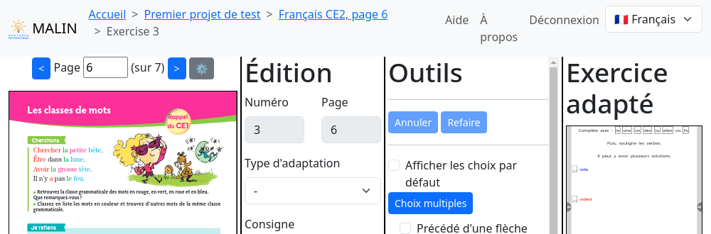
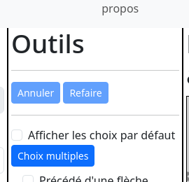

Vue d'extraction (Exercice)
===========================

Cette vue d'extraction est divisée en quatre colonnes :

- le PDF du manuel scolaire en entrée
- la zone d'édition et les outils associés
- la zone de pré-visualisation

Ces colonnes correspondent aux deux principales étapes de l'adaptation d'exercices depuis un manuel scolaire :

- la première consiste à extraire du PDF les textes et images (pas encore implémentée) des exercices, de la première à la deuxième colonne
- la seconde, à décrire comment adapter les exercices extraits, de la deuxième colonne à la troisième (pas encore complètement implémentée)

Chaque colonne dispose de sa propre barre de défilement verticale sur les écrans dont la hauteur le demande.

Création d'un exercice
----------------------

Le bouton "Annuler" permet de retourner à la liste des exercices existant sans enregistrer le nouvel exercice.

Il faut commencer par tracer un rectangle autour de l'exercice entier.

.. image:: project-textbook-page-exercise/create-exercise-tracing-bounding-rectangle.png
    :alt: Screenshot
    :align: center

Après cela, l'exercice est mis en valeur dans le PDF.
Cette mise en valeur est purement indicative et ne contraint en rien les selections ultérieures.

Le bouton "Enregistrer puis créer le suivant" est désactivé jusqu'à ce que le numéro de l'exercice soit renseigné.
Ce bouton permet ensuite d'enregistrer l'exercice et de vider le formulaire pour en créer un autre.
Le numéro de l'exercice suivant est automatiquement incrémenté, mais peut être modifié.

.. image:: project-textbook-page-exercise/create-exercise.png
    :alt: Screenshot
    :align: center

Extraction du texte du PDF
--------------------------

L'extraction du texte du PDF se fait en dessinant à la souris un rectangle autour du texte souhaité.
Le texte trouvé à l'intérieur de ce rectangle est mis en surbrillance.

Lorsqu'on relâche le bouton de la souris, le texte est extrait et affiché dans une boite de dialogue,
à proximité immédiate du pointeur pour limiter les déplacements de souris.

.. image:: project-textbook-page-exercise/selected-in-pdf.png
    :alt: Screenshot
    :align: center

On peut alors cliquer sur un des boutons de ce dialogue pour ajouter le texte dans le champ correspondant du formulaire d'édition.

Lignes et paragraphes
---------------------

Dans tous les champs de l'exercice, un simple retour à la ligne est ignoré : les deux lignes feront partie du même paragraphe.
Il faut insérer un double retour à la ligne pour marquer la fin d'un paragraphe.

Adaptation de l'exercices
-------------------------

Le champ "Type" permet de choisir le type d'adaptation à appliquer à l'exercice.
Il n'y a pour l'instant que quelques types d'adaptation disponibles, décrits ci-dessous.

"Selection de mots"
~~~~~~~~~~~~~~~~~~~

Chaque mot devient "clickable" pour le surligner d'une couleurs parmi un nombre de couleurs configurable par le champ "Nombre de couleurs".

Dans la consigne, il est possible d'utiliser les balises ``{selN|texte}`` pour surligner le texte ``texte`` avec la couleur numéro ``N``.

La case à cocher "Sélectionner aussi la ponctuation" permet de rendre la ponctuation sélectionnable ou non.

"Remplissage par texte libre"
~~~~~~~~~~~~~~~~~~~~~~~~~~~~~

Après saisie du champ "Trou à remplir", le contenu de ce champ est remplacé dans l'énoncé par un champ de saisie texte.

"Choix multiples"
~~~~~~~~~~~~~~~~~

Note: pour l'instant il n'est possible de définir les choix que dans la consigne.
Les choix dans l'énoncé seront supportés dans une version ultérieure.

Les choix doivent être définis dans la consigne en utilisant les balises ``{choice|texte}``.

Note: le formatage de l'exercice adapté n'est pas encore conforme.
Les choix possibles ne sont pas encore mis en valeur par un cadre dans la consigne,
et les réponse se font via une liste déroulante plutôt qu'un affichage *ad hoc*.
Ces limitations sont explicités dans la :doc:`roadmap <../changes>`.

Modification d'un exercice
--------------------------

Le numéro d'un exercice existant n'est pas modifiable pour éviter les confusions.
Vous pouvez toutefois supprimer un exercice mal numéroté et le recréer avec le bon numéro.

Les fonctionnalités d'extraction depuis le PDF sont les mêmes que lors de l'ajout d'un nouvel exercice.

Le bouton "Annuler" permet de retourner à la liste des exercices existant sans enregistrer les modifications.

Le bouton "Enregistrer" permet de sauvegarder les modifications apportées à l'exercice et de retourner à la liste des exercices existant.

.. image:: project-textbook-page-exercise/modify-exercise.png
    :alt: Screenshot
    :align: center

Largeur des colonnes
--------------------

Vous pouvez adapter la largeur des colonnes à votre utilisation en déplaçant la barre verticale entre deux colonnes.
Les largeurs que vous choisissez sont conservées pour les prochaines utilisations.

Les colonnes peuvent être masquées en les réduisant à leur minimum.
Elles sont alors remplacées par un bouton permettant de les afficher à nouveau.

Cette fonctionnalité peut être utilisée pour restaurer les largeurs par défaut colonnes.

Outils d'édition
----------------

Annuler et refaire
~~~~~~~~~~~~~~~~~~

Les boutons "Annuler" et "Refaire" permettent de revenir en arrière ou de retourner en avant dans l'historique des modifications apportées à l'exercice.

Note: cette fonctionnalité n'est encore qu'expérimentale. Les bugs connus sont listés dans la :doc:`roadmap <../changes>`.

Remplacer
~~~~~~~~~

Cet outil permet de remplacer toutes les occurrences d'une suite caractères par une autre dans les différents champs de l'exercice.

Il peut s'appliquer à tous les champs d'un coup ou à chaque champ individuellement en fonction du choix fait dans le menu déroulant "dans".

Dans les deux champs "Remplacer" et "par", il est possible d'utiliser certains marqueurs spéciaux:

- ``{line-end}`` : pour remplacer ou insérer des retours à la ligne
- ``{paragraph-end}`` : pour remplacer ou insérer des double retours à la ligne, marquant des fins de paragraphe

Ces marqueurs sont suggérés lors de la saisie d'un ``{`` ou d'un double-clic dans l'un de ces champs.
Ils peuvent être utilisés au sein d'une suite de caractères plus longue.

Les champs "Remplacer" et "dans" prennent automatiquement une valeur appropriée lors d'une sélection de texte dans un champ de l'exercice,
permettant ainsi de n'avoir à remplir que le champ "par".
