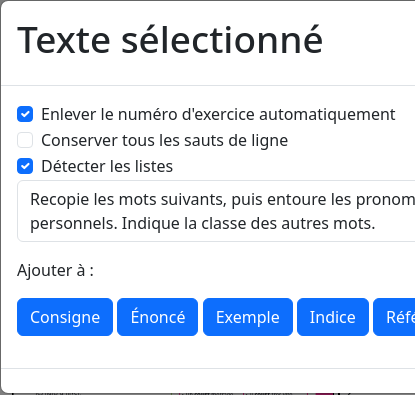
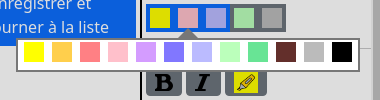
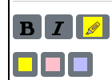
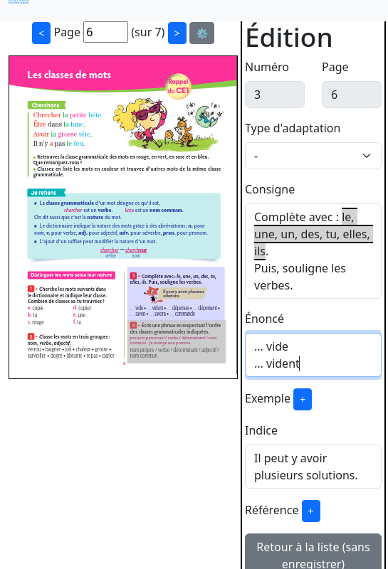

Vue d'extraction (Exercice)
===========================

Cette vue d'extraction est divisée en quatre colonnes :

- le PDF du manuel scolaire en entrée
- la zone d'édition et les outils associés
- la zone de pré-visualisation

Ces colonnes correspondent aux deux principales étapes de l'adaptation d'exercices depuis un manuel scolaire :

- la première consiste à extraire du PDF les textes et images (pas encore implémentée) des exercices, de la première à la deuxième colonne
- la seconde, à décrire comment adapter les exercices extraits, de la deuxième colonne à la troisième (pas encore complètement implémentée)

.. image:: project-textbook-page-exercise/project-textbook-page-exercise.png
   :alt: Screenshot
   :align: center

Chaque colonne dispose de sa propre barre de défilement verticale sur les écrans dont la hauteur le demande.

Création d'un exercice
----------------------

Le bouton "Précédent (sans enregistrer)" permet de retourner à l'exercice créé juste avant.

Le bouton "Enregistrer puis suivant" est désactivé jusqu'à ce que le numéro de l'exercice soit renseigné.
Ce bouton permet ensuite d'enregistrer l'exercice et de vider le formulaire pour en créer un autre.
Le numéro de l'exercice suivant est automatiquement incrémenté, mais peut être modifié.

Le bouton "Retour à la liste (sans enregistrer)" permet de retourner à la liste des exercices existants sans enregistrer le nouvel exercice.
Le bouton "Enregistrer et retourner à la liste" permet de sauvegarder le nouvel exercice et de retourner à la liste des exercices existants.

.. image:: project-textbook-page-exercise/create-exercise.png
    :alt: Screenshot
    :align: center

Extraction du texte du PDF
--------------------------

L'extraction du texte du PDF se fait en dessinant à la souris un rectangle autour du texte souhaité.
Le texte trouvé à l'intérieur de ce rectangle est mis en surbrillance.

.. image:: project-textbook-page-exercise/selecting-in-pdf.png
    :alt: Screenshot
    :align: center

Lorsqu'on relâche le bouton de la souris, le texte est extrait et affiché dans une boite de dialogue,
à proximité immédiate du pointeur pour limiter les déplacements de souris.

On peut alors cliquer sur un des boutons de ce dialogue pour ajouter le texte dans le champ correspondant du formulaire d'édition.

Lignes et paragraphes
---------------------

Dans les champs "consigne", "indice" et "example":

- les lignes de texte séparées par un unique retour à la ligne sont jointes dans le même paragraphe ;
- il est possible de créer un nouveau paragraphe explicitement en insérant un double retour à la ligne ;
- les phrases détectées sont séparées chacune dans leur propre paragraphe.

Dans le champ "énoncé", chaque ligne de texte constitue un paragraphe.

Adaptation de l'exercices
-------------------------

Le champ "Type" permet de choisir le type d'adaptation à appliquer à l'exercice.
Il n'y a pour l'instant que quelques types d'adaptation disponibles, décrits ci-dessous.

"Selection de mots"
~~~~~~~~~~~~~~~~~~~

Chaque mot devient "clickable" pour le surligner d'une couleurs parmi un ensemble de couleurs configurables.
Un clic (gauche) sur la dernière couleur souhaitée permet de rendre utilisables cette couleurs et les couleurs précédentes.

Un clic droit sur chaque couleur permet de la personnaliser.

Des boutons de formatage permettent d'utiliser les couleurs de l'exercice pour formatter certains mots de la consigne.

La case à cocher "Sélectionner aussi la ponctuation" permet de rendre la ponctuation sélectionnable ou non.

"Remplissage par texte libre"
~~~~~~~~~~~~~~~~~~~~~~~~~~~~~

Après saisie du champ "Trou à remplir", le contenu de ce champ est remplacé dans l'énoncé par un champ de saisie texte.

"Choix multiples (dans la consigne)"
~~~~~~~~~~~~~~~~~~~~~~~~~~~~~~~~~~~~

Le bouton "Choix" permet de mettre en forme chaque choix utilisable pour répondre à l'exercice.

Après saisie du champ "Trou à remplir", le contenu de ce champ est remplacé dans l'énoncé par un champ proposant les choix configurés.

"Choix multiples (dans l'énoncé)"
~~~~~~~~~~~~~~~~~~~~~~~~~~~~~~~~~

En cours d'implémentation.

Modification d'un exercice
--------------------------

Le numéro d'un exercice existant n'est pas modifiable pour éviter les confusions.
Vous pouvez toutefois supprimer un exercice mal numéroté et le recréer avec le bon numéro.

Les fonctionnalités d'extraction depuis le PDF sont les mêmes que lors de l'ajout d'un nouvel exercice.

Le bouton "Retour à la liste (sans enregistrer)" permet de retourner à la liste des exercices existant sans enregistrer les modifications.

Le bouton "Enregistrer et retourner à la liste" permet de sauvegarder les modifications apportées à l'exercice et de retourner à la liste des exercices existant.

Largeur des colonnes
--------------------

Vous pouvez adapter la largeur des colonnes à votre utilisation en déplaçant la barre verticale entre deux colonnes.
Les largeurs que vous choisissez sont conservées pour les prochaines utilisations.

Les colonnes peuvent être masquées en les réduisant à leur minimum.
Elles sont alors remplacées par un bouton permettant de les afficher à nouveau.

Cette fonctionnalité peut être utilisée pour restaurer les largeurs par défaut colonnes.

Outils d'édition
----------------

.. image:: project-textbook-page-exercise/tools.png
    :alt: Screenshot
    :align: center

Annuler et refaire
~~~~~~~~~~~~~~~~~~

Les boutons "Annuler" et "Refaire" permettent de revenir en arrière ou de retourner en avant dans l'historique des modifications apportées à l'exercice.

Formatage
~~~~~~~~~

Les boutons de formatage permettent de mettre en forme le texte sélectionné.
Le gras et l'italique sont disponibles en permanence.
D'autres boutons de formatage sont spécifiques à certains types d'exercice.
