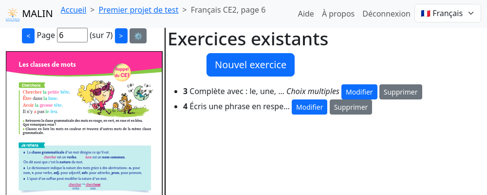
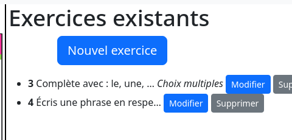
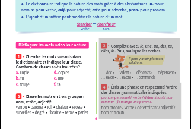

Vue d'extraction (Manuel)
=========================

Après avoir navigué jusqu'à une page d'un PDF, cette vue est composée de deux colonnes :

- le PDF du manuel scolaire en entrée
- la liste des exercises déjà extraits

Décalage des pages entre PDF et manuel
--------------------------------------

Un bouton en forme d'engrenage à proximité des boutons de navigation dans le PDF permet de régler cet éventuel décalage.

Rechargement du PDF
-------------------

Si un PDF n'a jamais été chargé dans le navigateur utilisé, un formulaire permettant de le charger le remplace dans la colonne de droite.

Note: les PDFs ouverts sont stockés dans le navigateur pour limiter le besoin de les recharger à chaque utilisation.
Ils ne sont *jamais* envoyés sur le serveur.

Liste des exercices existants
-----------------------------

Le bouton "Nouvel exercice" en bas de cette liste permet d'ajouter un exercices.
Des boutons "Modifier" et "Supprimer" sont associés aux exercices existants.

Les exercices existants sont également mis en valeur dans le pdf:

Création d'un exercice
----------------------

Le bouton "Nouvel exercice" mène à la :doc:`vue d'extraction (Exercice) <project-textbook-page-exercise>` pour créer un nouvel exercice.

Modification d'un exercice
--------------------------

Le bouton "Modifier" associé à un exercice mène à la :doc:`vue d'extraction (Exercice) <project-textbook-page-exercise>` pour modifier cet exercice.
